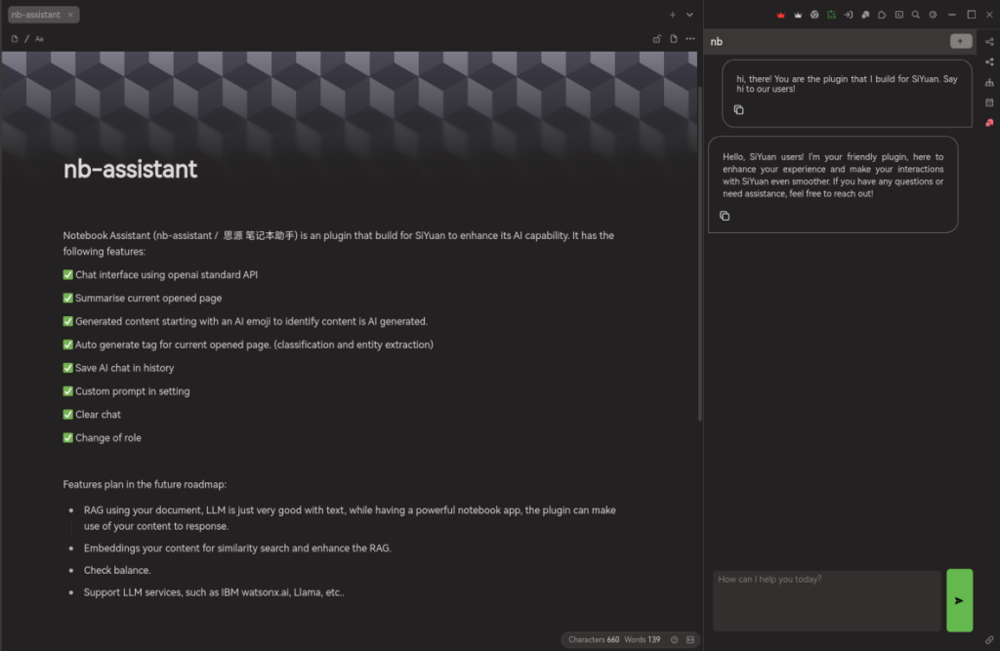
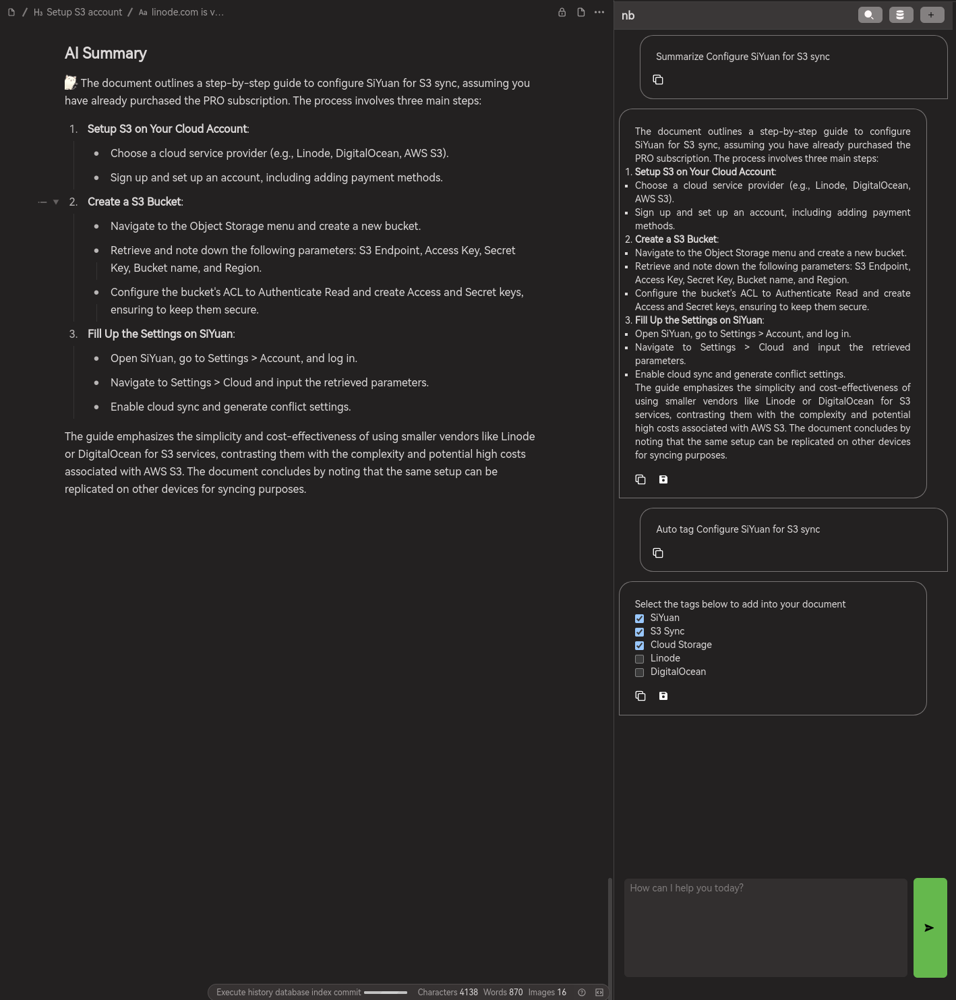
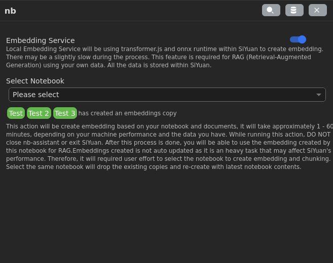
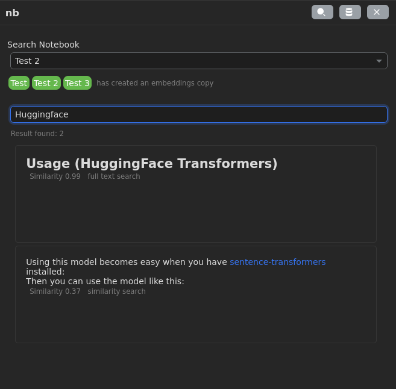
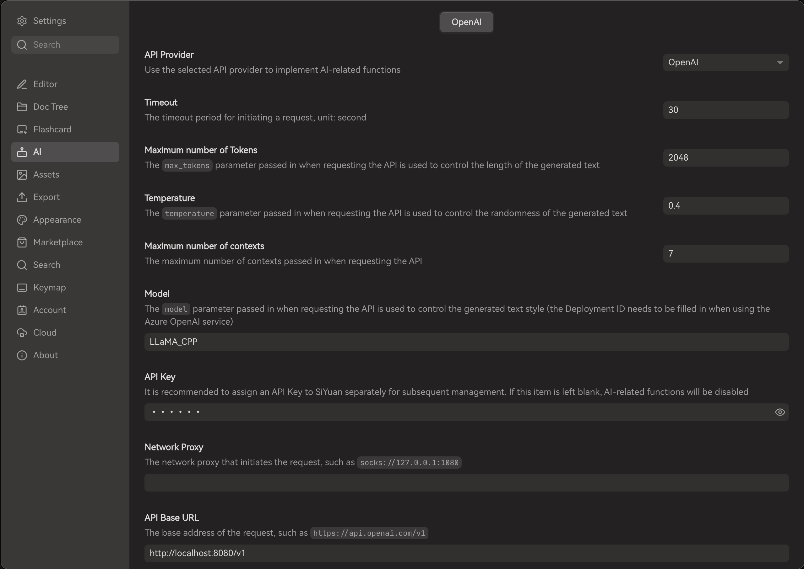
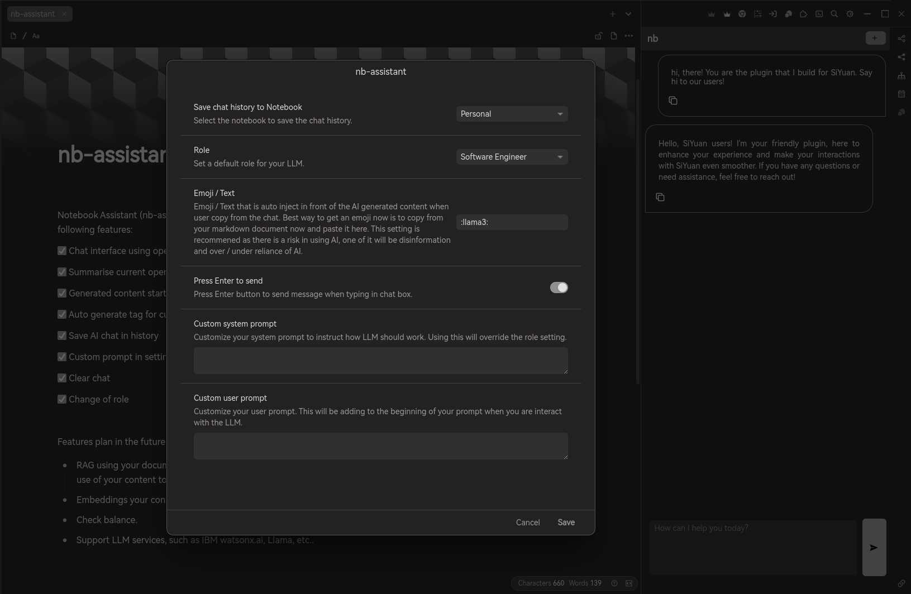

# nb-assistant

[中文版](./README_zh_CN.md)

Notebook Assistant (nb-assistant /  思源 笔记本助手) is an plugin that build for SiYuan to enhance its AI capability. 

0.1.4 rc is release now!

Refactor the extension to support:

✅ Friendly UI

✅ Multiple ai model switch, OpenAI, DeepSeek, Claude, Ollama

✅ Create Embedding by Ollama, OpenAI and Transformer.js

✅ Save, regenerate, copy and delete chat messages

✅ Save chat history and find it back easily

✅ Generate images under experimental feature (only supported for OpenAI Dall-E 3)

✅ Reasoning model supported

✅ Quick action by typing `@` in chatbox

✅ Persist context in chat, remember context in chat history

✅ Hybrid search strategy by combining similarity result and full text search.

---



It has the following features:

✅ Chat interface using openai standard API

✅ Summarise current opened page

✅ Generated content starting with an AI emoji to identify content is AI generated. 

✅ Auto generate tag for current opened page. (classification and entity extraction) 

✅ Save AI chat in history

✅ Custom prompt in setting

✅ Clear chat

✅ Change of role

### 0.1.3 Update



✅ Create embedding based on your notebook by using transformer.js and onnx runtime.



✅ Search document based on similarity.

✅ Hybrid search strategy by combining similarity result and full text search.



✅ Open document from search result.

✅ Chat with your document, start by typing / on your chat box.

✅ Chat with your notebook, start by typing @ on your chat box. Result may vary due to notebook structure, content store within one notebook, etc.

✅ Select tags to be adding into your document when using auto tag shortcut.

✅ Save summary into your document after summary is generated.

✅ Prompt chaining for larger document in order to fine tune the context and response.

To use the plugin, you will first complete default SiYuan AI setting, for example:



*btw, the settings above can be apply for using local llama or llamafile (https://github.com/Mozilla-Ocho/llamafile) as well. Since SiYuan default AI settings support for OpenAI API spec, you can try to connect with other service provider too.*

Features plan in the future roadmap:

* RAG using your document, LLM is just very good with text, while having a powerful notebook app, the plugin can make use of your content to response.
* Embeddings your content for similarity search and enhance the RAG.
* Check balance.
* Support LLM services, such as IBM watsonx.ai, Llama, etc..


---

Current limitation

* Zero shot. You are only prompting the LLM to response, so the result is all depends how well the LLM is trained.
* This plugin is still in development and expect to be under preview for quite a long time to make it work good.

---




---

### Limitation for 0.1.3

Everytime you restart SiYuan and using services that required to create embedding, for example, chat with your notebook, create embedding, serch notebook. You are required to download the model online again, approximately (30mb). 

If you do not want this behaviour, you will have to start SiYuan with a specific port.

Reason behind is due to electron caching. (https://github.com/siyuan-note/siyuan/issues/11969)

To do it in Linux:

Option 1 

```shell
siyuan --port=16806
```

Option 2 

1. vi /usr/share/applications/siyuan.desktop

2. modify Exec line to below

```
│Exec=/opt/SiYuan/siyuan --port=16806 %U
```

3. Start SiYuan as usual
