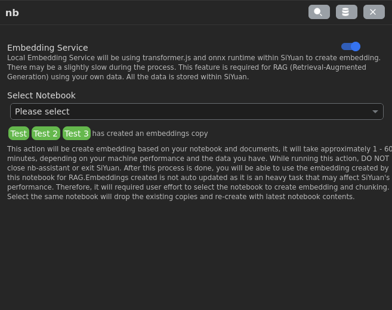
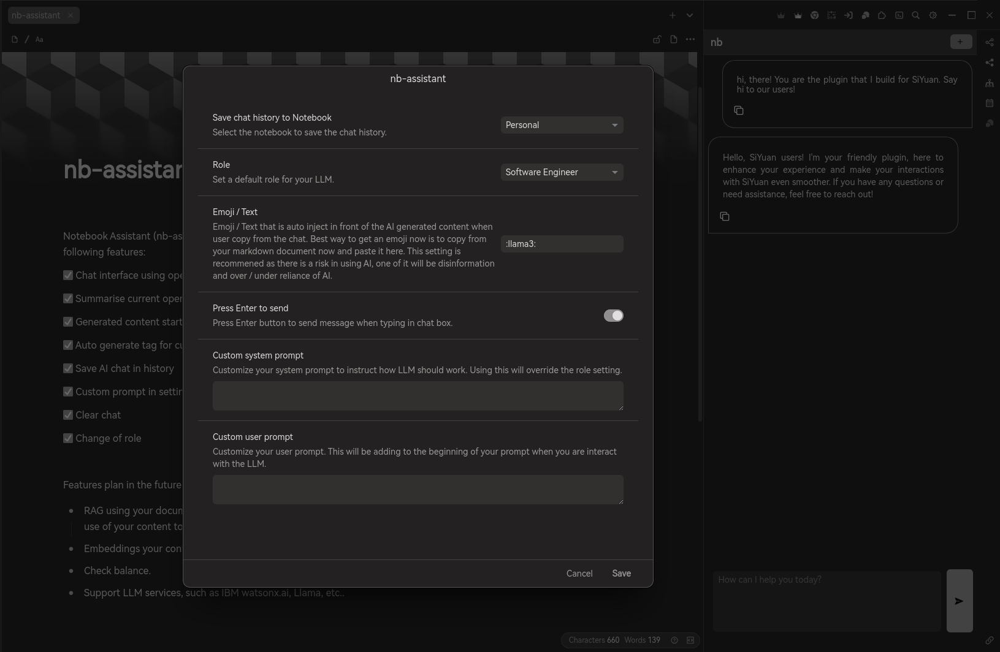

# 思源笔记本助手

[English](./README.md)

思源笔记本助手 (nb-assistant) 是一个为 SiYuan 构建的插件，旨在增强其 AI 能力。

0.1.3 已经发布！


它具有以下功能：

✅ 使用 OpenAI 标准 API 的聊天界面

✅ 总结当前打开的页面

✅ 生成的内容以 AI 表情符号开头，以识别内容是 AI 生成的

✅ 自动为当前打开的页面生成标签（分类和实体提取）

✅ 保存 AI 聊天记录

✅ 在设置中自定义提示

✅ 清除聊天记录

✅ 角色切换让大模型更好的回答你的问题

### 0.1.3 的更新


✅ 使用transformer.js和onnx runtime根据您的笔记本创建嵌入。


✅ 搜索基于相似度搜索文档。

✅ 通过结合相似度结果和全文搜索实现混合搜索策略。


✅ 从搜索结果中打开文档。

✅ 与您的文档聊天，开始在聊天框中输入/。

✅ 与您的笔记本聊天，开始在聊天框中输入@。由于笔记本结构、内容存储在一个笔记本中等因素，结果可能会有所不同。

✅ 在使用自动标签快捷方式时选择要添加到文档中的标签。

✅ 在生成摘要后将摘要保存到文档中。

✅ 为了微调上下文和响应，对较大文档进行提示链。


注意！这个插件使用思源原生AI设置，你需要完成AI设置才能使用这个插件。


*以上设置同时也适用于本地LLM的配置，当然任何支持OpenAI API spec的服务也可以尝试配置。*

未来路线图中的功能计划：

* 使用您的文档进行 RAG，LLM 在文本处理方面非常出色，而拥有一个强大的笔记本应用程序，插件可以利用您的内容进行响应。
* 嵌入您的内容以进行相似性搜索并增强 RAG。
* 检查余额。
* 支持 LLM 服务，例如 IBM watsonx.ai、Llama 等。

---

当前版本限制

* Zero shot。您只是提示 LLM 进行响应，因此结果完全取决于 LLM 的训练程度。
* 该插件仍在开发中，预计需要相当长的时间进行预览，以使其表现良好。

---




---

### 现阶段不完美的地方
每次重启 SiYuan 并使用需要创建嵌入(Embedding)相关的服务时，例如与笔记本聊天、创建嵌入、搜索笔记本，都需要再次下载模型，大约 30MB， 那样会耗费用户一点点的流量。

### 原因
这是由于 Electron 缓存机制导致的。（参考链接：https://github.com/siyuan-note/siyuan/issues/11969）

### 解决方案
如果你不希望这种行为，你需要以特定端口启动 SiYuan。

#### 在 Linux 上的解决方案

#### 选项 1

```shell
siyuan --port=16806
```

#### 选项 2

1. 打开终端并编辑 SiYuan 的桌面启动文件：

```shell
vi /usr/share/applications/siyuan.desktop
```

2. 修改 `Exec` 行，将其改为以下内容：

```
Exec=/opt/SiYuan/siyuan --port=16806 %U
```

3. 像往常一样启动 SiYuan。

### 详细步骤解释

#### 选项 1 详细解释

- **命令行启动**：直接在终端中输入以下命令启动 SiYuan：

  ```shell
  siyuan --port=16806
  ```

  这会以指定的端口 `16806` 启动 SiYuan，从而避免每次启动时重新下载模型。

#### 选项 2 详细解释

1. **编辑桌面启动文件**：

   - 打开终端并输入以下命令以编辑 SiYuan 的桌面启动文件：

     ```shell
     vi /usr/share/applications/siyuan.desktop
     ```

   - 使用 `vi` 编辑器打开文件后，找到 `Exec` 行。

2. **修改 `Exec` 行**：

   - 将 `Exec` 行修改为以下内容：

     ```
     Exec=/opt/SiYuan/siyuan --port=16806 %U
     ```

   - 这一步的目的是在启动 SiYuan 时自动使用指定的端口 `16806`，从而避免重新下载模型。

3. **启动 SiYuan**：

   - 修改完成后，保存并退出编辑器。
   - 像往常一样通过桌面图标或启动菜单启动 SiYuan。

通过以上步骤，你可以避免每次启动 SiYuan 时重新下载模型，从而提高使用效率。
